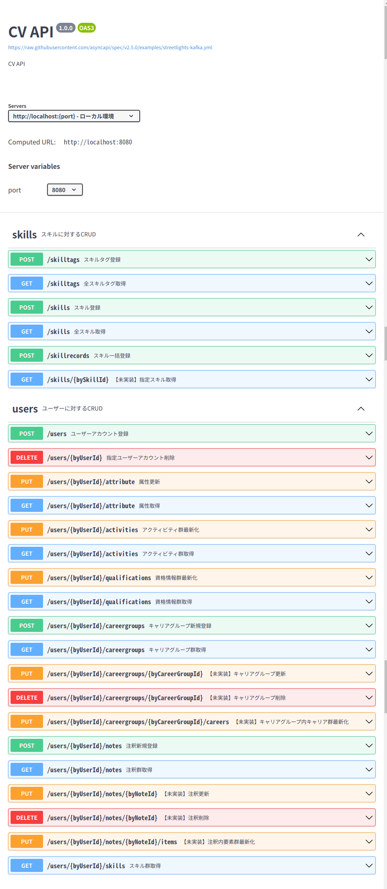

# cv-admin

GitHub Pages にて公開している [Curriculum-Vitae](https://sky0621.github.io/cv/) のデータソースを管理する。

データソース管理には [SQLite](https://www.sqlite.org/index.html) を使う。

データソースへのアクセス用に Web API エンドポイントを用意。

API定義は [OpenAPI v3](https://swagger.io/specification/) に準拠。

Yamlは、[これ](./schema/openapi.yml) （プレビュー用にdockerfile書こうと思ったけどIDEのプレビュー機能で十分だったので省略）。

[swagger.ioのエディタ](https://editor-next.swagger.io/) に貼ってもいい。



Oops. 未実装が目立つ・・・。

## function

※ローカル実行は [go (v1.19)](https://go.dev/) インストール済みが前提。

cv-admin ディレクトリ直下で以下を叩く。

### server

ローカルでAPIサーバー起動。

```
go run src/main.go server
```

### migrate

[ent.(ORM)](https://entgo.io/ja/) で定義したテーブル定義を [SQLite](https://www.sqlite.org/index.html) ファイルに反映する。

```
go run src/main.go migrate
```

### export

APIサーバーにアクセスして取得したデータソースをJSON形式で指定先にエクスポートする。

これを使って [cv](https://github.com/sky0621/cv) リポジトリのフロントエンド機能がキャリアシートのWebページを表示する。

※APIサーバーが起動していることが前提。

```
go run src/main.go export --userid 【ユーザーIDを指定】 --dir 【出力先パスを指定】
```

### submission

APIサーバーにアクセスして取得したデータソースをExcel形式でエクスポートする。

※紙媒体ないしExcelファイルでの提出を求められた時用。

※APIサーバーが起動していることが前提。

```
go run src/main.go submission --userid 【ユーザーIDを指定】
```

※未コミットの「`.private.ini`」ファイル（以下のような内容）をプロジェクトルート直下に置く。

```
password = xxxxxxxxxx
kana = ヤマダ　タロウ
name = 山田　太郎
mail = hogehoge@example.com
educationalBackground = 20XX年3月　○○大学□□学部　卒業
cityOfResidence = ○○県□□市
nearestStation = JR東日本　○○駅
cvWeb = https://sky0621.github.io/cv/
cvAdmin = https://github.com/sky0621/cv-admin#submission
```

#### Excelサンプル

sample/skill_sheet.xlsx


　　　　　　　　　　　　　　・

　　　　　　　　　　　　　　・

　　　　　　　　　　　　　　・

## env

### OS

```
Mac Book Air M2 2022
Ventura 13.2.1
```

### go

```
❯ go version
go version go1.20.2 darwin/arm64
```

## setup

### project

```
$ go mod init github.com/sky0621/cv-admin
go: creating new go.mod: module github.com/sky0621/cv-admin
```

### open-api-codegen

https://github.com/getkin/kin-openapi

https://github.com/deepmap/oapi-codegen

```
go install github.com/deepmap/oapi-codegen/cmd/oapi-codegen@latest
```

### ent

from entity model to db table

```
cd src/ent
```

```
go run -mod=mod entgo.io/ent/cmd/ent new User UserActivity UserQualification UserCareerGroup UserCareer UserCareerDescription UserCareerPeriod CareerTask CareerSkillGroup CareerSkill UserNote UserNoteItem SkillTag Skill
```

### cobra

https://github.com/spf13/cobra

https://github.com/spf13/cobra-cli/blob/main/README.md

```
go install github.com/spf13/cobra-cli@latest
```

```
cobra-cli init
```

#### add command

```
cd src
```

```
cobra-cli add server
```

### ozzo-validation

https://github.com/go-ozzo/ozzo-validation